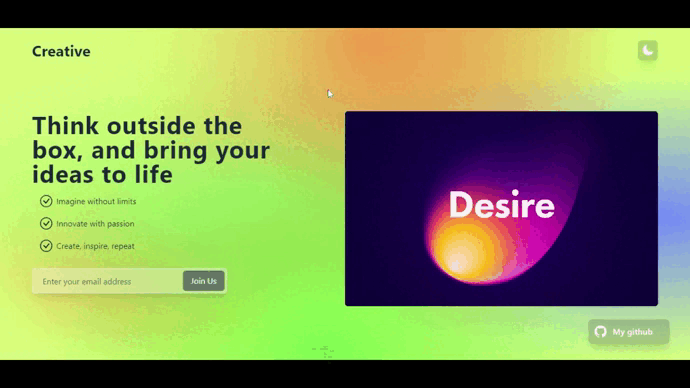

## Documentation for Creative page

### Introduction
This project, named Creative_page, is a creative landing page that showcases images with motivational messages. The page also features a dynamic background gradient and a dark mode toggle.

### Table of Contents
1. [Screen_Recording](#screen_recording)
2. [Installation](#installation)
3. [Usage](#usage)
4. [Components](#components)
    - [ModeSwitcher](#modeswitcher)
    - [Navbar](#navbar)
    - [Main](#main)

### Screen_Recording



### Installation
To run the Creative_page project locally, follow these steps:

1. Clone the GitHub repository:
   ```bash
   git clone https://github.com/abdellah-agrm/Creative_page.git
   ```

2. Navigate to the project directory:
   ```bash
   cd Creative_page
   ```

3. Install dependencies:
   ```bash
   npm install
   ```

4. Start the development server:
   ```bash
   npm start
   ```

5. Open your browser and visit [http://localhost:2000](http://localhost:2000) to view the project.

### Usage
The Creative_page project is a creative landing page that automatically cycles through a series of images with motivational messages. Users can also manually switch between dark and light modes using the mode switcher in the navigation bar.

### Components

#### ModeSwitcher
The `ModeSwitcher` component is responsible for toggling between dark and light modes. It uses the `SunIcon` and `MoonIcon` from the Heroicons library to represent light and dark modes, respectively. The component is integrated into the `Navbar`.

#### Navbar
The `Navbar` component is a navigation bar that contains the project title and the `ModeSwitcher`. It is used within the `Main` component.

#### Main
The `Main` component is the main section of the landing page. It features a dynamic background gradient, motivational messages, and a rotating set of images. Users can subscribe to updates by entering their email addresses.
